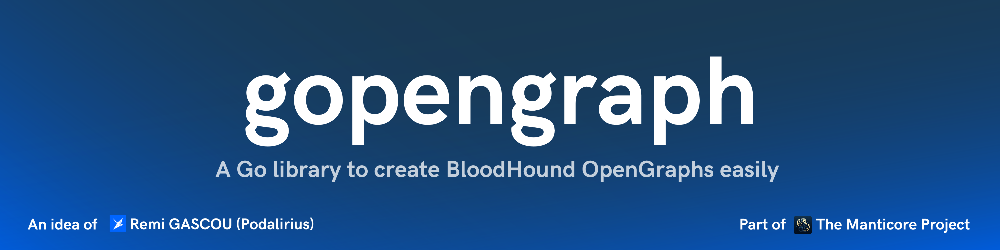

<p align="center">
  A Go library to create BloodHound OpenGraphs easily
  <br>
  <a href="https://pkg.go.dev/github.com/TheManticoreProject/bhopengraph"></a>
  
  <a href="https://twitter.com/intent/follow?screen_name=podalirius_" title="Follow"></a>
  <a href="https://www.youtube.com/c/Podalirius_?sub_confirmation=1" title="Subscribe"></a>
   <a href="https://specterops.io/bloodhound-enterprise/" title="Get BloodHound Enterprise"></a>
  <a href="https://specterops.io/bloodhound-community-edition/" title="Get BloodHound Community"></a>
  <br>
  <br>
  This library also exists in: <a href="https://github.com/TheManticoreProject/gopengraph">Go</a> | <a href="https://github.com/p0dalirius/bhopengraph">Python</a>
</p>

## Features

This module provides Go types and helpers for creating and managing graph structures that are compatible with BloodHound OpenGraph. The APIs follow the [BloodHound OpenGraph schema](https://bloodhound.specterops.io/opengraph/schema) and [best practices](https://bloodhound.specterops.io/opengraph/best-practices).

If you don't know about BloodHound OpenGraph yet, a great introduction can be found here: [https://bloodhound.specterops.io/opengraph/best-practices](https://bloodhound.specterops.io/opengraph/best-practices)

## Installation

Install with:

```bash
go get github.com/TheManticoreProject/bhopengraph
```

## Examples

Here is an example of a Go program using the [bhopengraph](https://github.com/TheManticoreProject/bhopengraph) Go library to model the [Minimal Working JSON](https://bloodhound.specterops.io/opengraph/schema#minimal-working-json) from the OpenGraph Schema documentation:

```go
package main

import (
	"github.com/TheManticoreProject/bhopengraph"
	"github.com/TheManticoreProject/bhopengraph/edge"
	"github.com/TheManticoreProject/bhopengraph/node"
	"github.com/TheManticoreProject/bhopengraph/properties"
)

func main() {
	// Create an OpenGraph instance
	graph := bhopengraph.NewOpenGraph("Base")

	// Create nodes
	bobProps := properties.NewProperties()
	bobProps.SetProperty("displayname", "bob")
	bobProps.SetProperty("property", "a")
	bobProps.SetProperty("objectid", "123")
	bobProps.SetProperty("name", "BOB")

	bobNode, _ := node.NewNode("123", []string{"Person", "Base"}, bobProps)

	aliceProps := properties.NewProperties()
	aliceProps.SetProperty("displayname", "alice")
	aliceProps.SetProperty("property", "b")
	aliceProps.SetProperty("objectid", "234")
	aliceProps.SetProperty("name", "ALICE")

	aliceNode, _ := node.NewNode("234", []string{"Person", "Base"}, aliceProps)

	// Add nodes to graph
	graph.AddNode(bobNode)
	graph.AddNode(aliceNode)

	// Create edge: Bob knows Alice
	knowsEdge, _ := edge.NewEdge(
		bobNode.GetID(),   // Bob is the start
		aliceNode.GetID(), // Alice is the end
		"Knows",
		nil,
	)

	// Add edge to graph
	graph.AddEdge(knowsEdge)

	// Export to file
	graph.ExportToFile("minimal_working_json.json")
}
```

This gives us the following [Minimal Working JSON](https://bloodhound.specterops.io/opengraph/schema#minimal-working-json) as per the documentation:

```json
{
  "graph": {
    "edges": [
      {
        "end": {
          "match_by": "id",
          "value": "234"
        },
        "kind": "Knows",
        "start": {
          "match_by": "id",
          "value": "123"
        }
      }
    ],
    "nodes": [
      {
        "id": "123",
        "kinds": [
          "Person",
          "Base"
        ],
        "properties": {
          "displayname": "bob",
          "name": "BOB",
          "objectid": "123",
          "property": "a"
        }
      },
      {
        "id": "234",
        "kinds": [
          "Person",
          "Base"
        ],
        "properties": {
          "displayname": "alice",
          "name": "ALICE",
          "objectid": "234",
          "property": "b"
        }
      }
    ]
  },
  "metadata": {
    "source_kind": "Base"
  }
}
```

## Contributing

Pull requests are welcome. Feel free to open an issue if you want to add other features.

## References

- [BloodHound OpenGraph Best Practices](https://bloodhound.specterops.io/opengraph/best-practices)
- [BloodHound OpenGraph Schema](https://bloodhound.specterops.io/opengraph/schema)
- [BloodHound OpenGraph API](https://bloodhound.specterops.io/opengraph/api)
- [BloodHound OpenGraph Custom Icons](https://bloodhound.specterops.io/opengraph/custom-icons)
